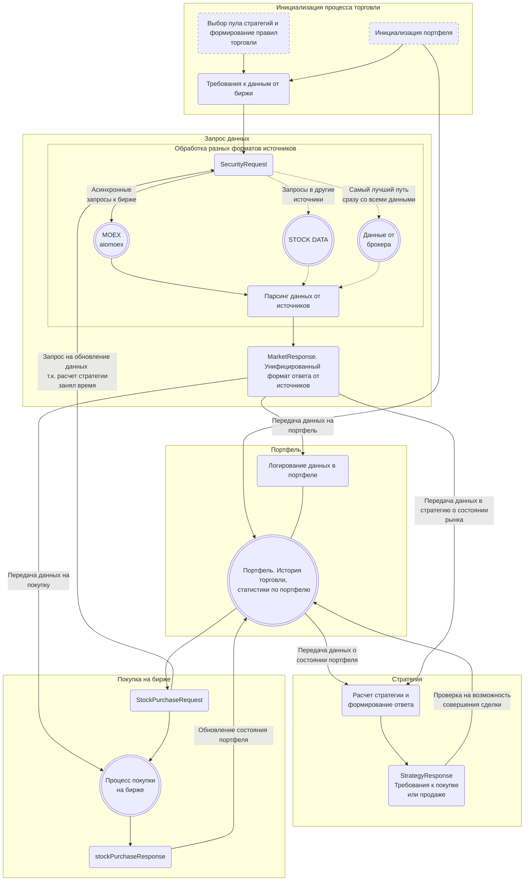

# stock-bot

stock bot python

```mermaid

flowchart 
    
    subgraph Запрос данных 
    
        
        
        subgraph Обработка разных форматов источников
        
            stockRequest(SecurityRequest)
            stockRequest --> |Асинхронные \n запросы к бирже| moex(((MOEX \naiomoex)))
            stockRequest -.-> |Запросы в другие \n источники| anotherStockData(((STOCK DATA)))
            moex --> stockResponseParser(Парсинг данных от источников)
            stockRequest -.-> |Самый лучший путь \n сразу со всеми данными| broker(((Данные от \nброкера)))
            anotherStockData -.->  stockResponseParser
            broker -.-> stockResponseParser
            
        end
        
        stockResponseParser --> stockResponse(MarketResponse. Унифицированный \n формат ответа от источников)
    
    end 
    
    subgraph Инициализация процесса торговли 
    
        initialStrategies(Выбор пула стратегий и \n формирование правил торговли) --> dataRequirments(Требования к данным от биржи)
        dataRequirments --> stockRequest 
        style initialStrategies stroke-dasharray: 5 5
        
        initialPortfolio(Инициализация портфеля) 
        style initialPortfolio stroke-dasharray: 5 5
        
        initialPortfolio --> dataRequirments
    end
    
    
    subgraph Портфель 
        
        portfolio(((Портфель. История торговли,\n статистики по портфелю)))
        initialPortfolio --> portfolio
        stockResponse --> |Передача данных на \n портфель| portfolioLog(Логирование данных в портфеле) 
        portfolioLog --- portfolio
        
    end
    
    subgraph Стратегия 
    
        portfolio --> |Передача данных о \n состоянии портфеля| strategy
        strategyResponse --> |Проверка на возможность \n совершения сделки| portfolio
        stockResponse --> |Передача данных в \n стратегию о состоянии рынка| strategy(Расчет стратегии и \n формирование ответа)
        strategy --> strategyResponse(StrategyResponse \n Требования к покупке \n или продаже)
    
    end
    
    subgraph Покупка на бирже 
        portfolio --> stockPurchaseRequest(StockPurchaseRequest) 
        stockPurchaseRequest --> |Запрос на обновление данных \n т.к. расчет стратегии занял время | stockRequest 
        
        StockPurchaseProcess(((Процесс покупки \n на бирже))) 
        
        stockResponse --> |Передача данных на \n покупку| StockPurchaseProcess
        stockPurchaseResponse(stockPurchaseResponse) --> |Обновление состояния портфеля| portfolio
        
        stockPurchaseRequest --> StockPurchaseProcess --> stockPurchaseResponse
    
    end    
```